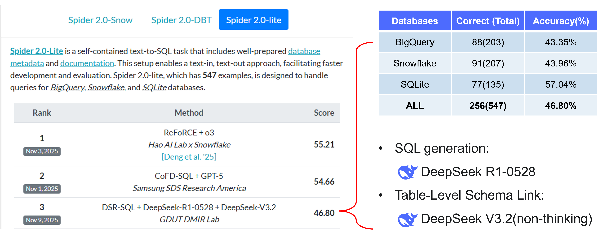

# Text-to-SQL as Dual-State Reasoning: Integrating Adaptive Context and Progressive Generation
<p align="center">
  <small>
    Authors: 
    <a href="https://scholar.google.com/citations?hl=en&user=ZF3gp9wAAAAJ&view_op=list_works&sortby=pubdate">Zhifeng Hao</a> | 
    <a href="https://github.com/qcjySONG">Qibin Song</a> | 
    <a href="https://ruichucai.github.io/">Ruichu Cai</a> | 
    <a href="https://boyanxu1.github.io/">Boyan Xu*</a>
    <br>
    🤗If you find our work helpful, please don't hesitate to give us a star!✨
  </small>
</p>


## 🔭 Overview

Recent divide-and-conquer reasoning approaches, particularly those based on Chain-of-Thought (CoT), have substantially improved the Text-to-SQL capabilities of Large Language Models (LLMs). However, when applied to complex enterprise databases, such methods struggle to maintain coherent reasoning due to limited context capacity, unreliable schema linking, and weak grounding in database semantics. To overcome these issues, we introduce DSR-SQL, a Dual-State Reasoning framework that models Text-to-SQL as an interaction between an adaptive context state and a progressive generation state. The adaptive context state constructs a compact, semantically faithful environment by refining large schemas and selecting relevant structures, while the progressive generation state formalizes SQL synthesis as feedback-guided state transitions, enabling the model to self-correct and better align with user intent. Without any post-training or in-context examples, DSR-SQL achieves competitive performance, reaching 35.28% execution accuracy on Spider 2.0-Snow and 68.32% on the BIRD development set.


## 💎 Results



> We are still refining the program to achieve higher stability and accuracy~
<details>
<summary><strong>Click to expand: Important context regarding Dataset Versions & New Results</strong></summary>

During the external review period of our paper, both datasets used in our work underwent significant version upgrades. For the Spider 2.0 series, the new version only updated the evaluation set. For the BIRD dev set, the new version performed substantial disambiguation and error correction on questions, evidence, SQL queries, and more. Both dataset updates aim to better align with human intuition and reduce annotation bias (although it would be even better if the BIRD evaluation metric, EX, could tolerate a small numerical rounding margin). We sincerely appreciate the efforts and dedication of the respective teams behind these updates.

Furthermore, **we earnestly encourage everyone to conduct comparisons using the new versions of these evaluation sets**, rather than the older versions reported in our paper. (Given that our paper is already under external review, and considering the API costs and methodological consistency based on the old datasets, we currently do not plan to fully adopt the new versions within the paper.)


</details>

## 💻 Code Releases

*   **Spider2.0-Lite task:** Our implementation will be publicly released **before December 10, 2025.**  
*   **Spider2.0-Snow and BIRD tasks:** Our implementation will be open-sourced following the acceptance of the associated research paper.

> **Important Notes:**
>
> *   Directly applying the Spider2.0-Lite codebase to other tasks like Spider2-Snow or BIRD may yield performance that differs from the results reported in our paper.
> *   It should be noted that the paper (under review) is based on a past (legacy) version of the evaluation data. In contrast, the Spider2.0-Lite task currently uses the new version of the evaluation data released by [the Spider2 team on October 29, 2025](https://github.com/xlang-ai/Spider2?tab=readme-ov-file#-news).


## 🚀 Quick Start

- TBD

## 🐞 Error Analysis


## 🤗 Acknowledgements

We were inspired by the following projects and appreciate the authors for their timely and productive discussions:

* **ReFoRCE: A Text-to-SQL Agent with Self-Refinement, Consensus Enforcement, and Column Exploration**
    * [Paper](https://arxiv.org/abs/2502.00675) | [Code](https://github.com/Snowflake-Labs/ReFoRCE) | [Discussion](https://github.com/Snowflake-Labs/ReFoRCE/issues/1)

* **Alpha-SQL: Zero-Shot Text-to-SQL using Monte Carlo Tree Search**
    * [Paper](https://arxiv.org/abs/2502.17248) | [Code](https://github.com/HKUSTDial/Alpha-SQL) | [Discussion](https://github.com/HKUSTDial/Alpha-SQL/issues/3)

* **OmniSQL: Synthesizing High-quality Text-to-SQL Data at Scale**
    * [Paper](https://arxiv.org/abs/2503.02240) | [Code](https://github.com/RUCKBReasoning/OmniSQL) | [Discussion](https://github.com/RUCKBReasoning/OmniSQL/issues/32)

Additionally, we would like to give special thanks to the [Spider2.0 Team](https://spider2-sql.github.io/) and the [BIRD Team](https://bird-bench.github.io/) for providing excellent evaluation datasets, and we extend our respect to all open-source contributors!
Finally, we are deeply grateful to the [DeepSeek-AI](https://github.com/deepseek-ai/DeepSeek-R1) team for providing their powerful and affordable base model, which made the implementation of this project possible.

## ⚠️ Limitations

* Our method relies heavily on reasoning models, which inevitably results in higher latency (i.e., greater time consumption), with its primary application scenarios centered around deep-research data analysis of large-scale databases. If your task has strict latency requirements, please refer to our previous works, [GenLink](https://github.com/DMIRLAB-Group/GenLink) and [Track-SQL](https://github.com/DMIRLAB-Group/Track-SQL), or other excellent works in the community.
* The BIRD benchmark demands highly fine-grained schema alignment. DSR-SQL currently shows a significant performance gap compared to State-of-the-Art (SOTA) methods that utilize In-Context Learning (ICL) or Post-training.

## 💡 Other

* For any questions or discussions regarding DSR-SQL, please submit an issue.
* For potential collaborations and further discussions, please contact the corresponding author at: hpakyim@gmail.com

## 📝 Citation
If you find our work useful or inspiring, please kindly cite:
```bibtex
@misc{hao2025texttosqldualstatereasoningintegrating,
      title={Text-to-SQL as Dual-State Reasoning: Integrating Adaptive Context and Progressive Generation}, 
      author={Zhifeng Hao and Qibin Song and Ruichu Cai and Boyan Xu},
      year={2025},
      eprint={2511.21402},
      archivePrefix={arXiv},
      primaryClass={cs.CL},
      url={https://arxiv.org/abs/2511.21402}, 
}
```
